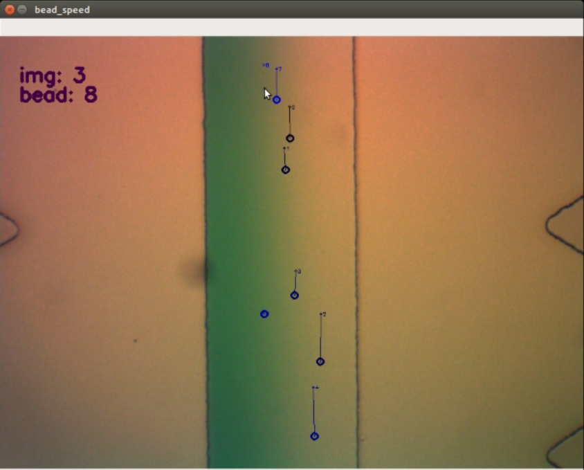

# bead_speed

Keep track of your microbead speeds :)



## how to run

Make sure that you have [python3 and pip3](https://realpython.com/installing-python/) installed.
Then, make sure that your directory full of microbead image files is in the same directory as *bead_speed.py*.
At the command line, in that same directory, run the following:
```
python3 bead_speed.py
```

Input the directory whose beads you'd like to track, and the first image (img 0) should pop up. It should look something like the image above. Now you can navigate through the images and place markers for the currently selected bead at the mouse position.

## summary of controls

- *w / up* - increment bead index
- *s / down* - decrement bead index
- *a / left* - decrement image index
- *d / right* - increment image index
- *backspace / delete* - delete the currently selected bead marker
- *leftmouseclick* - place a bead marker at the current mouse position
- *esc / (increment past last image)* - exit the program and output the results

## send bug reports to

zackpi@mit.edu
